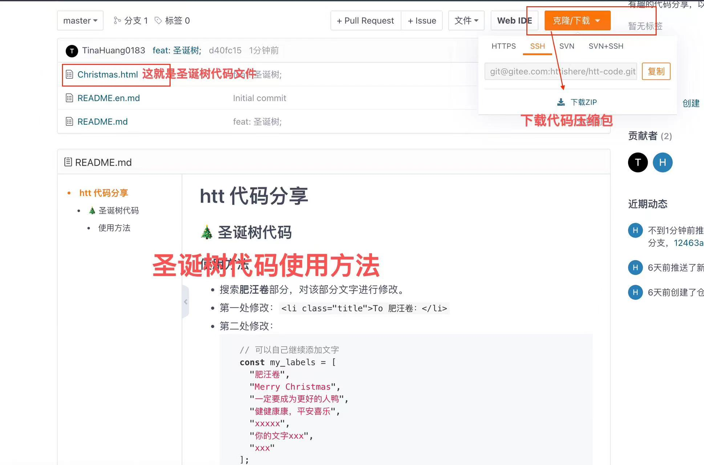
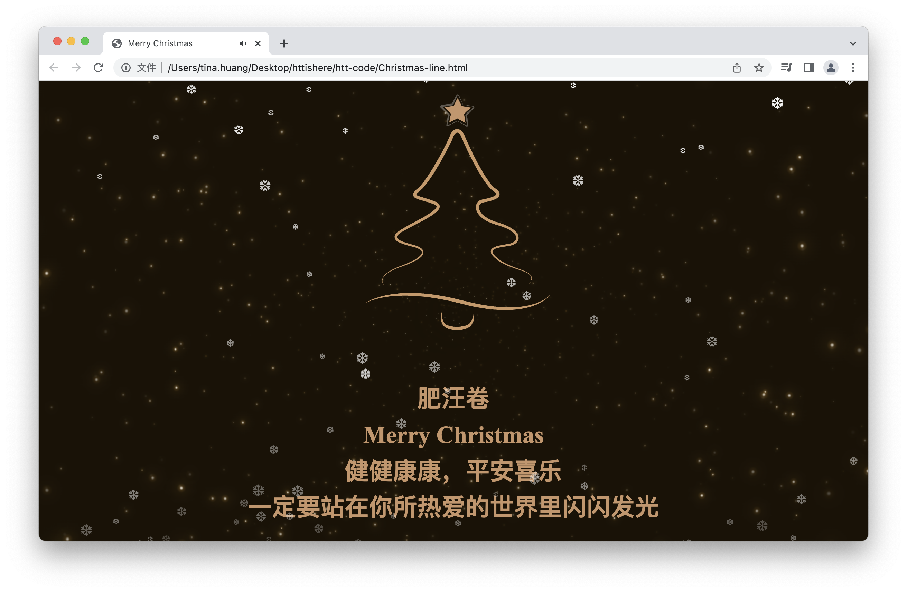

# 代码分享（⚠️ 请下载代码后再修改）

## ‼️ 下载代码


## 教程视频请看👀 ⬇️ ⬇️
### 小红书：肥汪卷，B站：阿汪同学，抖音：httishere0728
---

## 🎄 圣诞树代码 第二弹（有音乐：Christmas-line.html，无音乐：Christmas-no-music.html）



### 使用方法

- 搜索**肥汪卷**部分，对该部分文字进行修改。
  ```js
  let myLabels = [
      "肥汪卷",
      "Merry Christmas",
      "健健康康，平安喜乐",
      "一定要站在你所热爱的世界里闪闪发光",
  ];
  ```
- 修改音乐，替换下面代码的链接部分
  ```js
  let music_url = "http://music.163.com/song/media/outer/url?id=1892513656.mp3";
  ```
## 🎄 圣诞树代码 第一弹（Christmas.html）


### 使用方法

- 搜索**肥汪卷**部分，对该部分文字进行修改。
- 第一处修改：`<li class="title">To 肥汪卷：</li>`
- 第二处修改：
    ```js
      // 可以自己继续添加文字
      const my_labels = [
        "肥汪卷",
        "Merry Christmas",
        "一定要成为更好的人鸭",
        "健健康康，平安喜乐",
        "xxxxx",
        "你的文字xxx",
        "xxx"
      ];
    ```